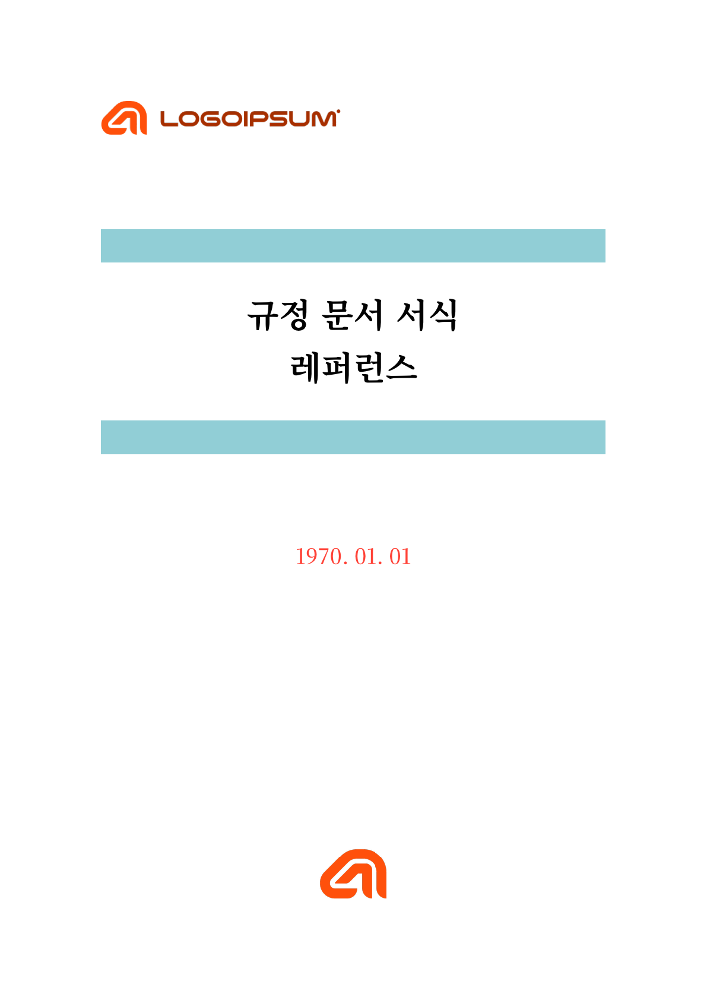
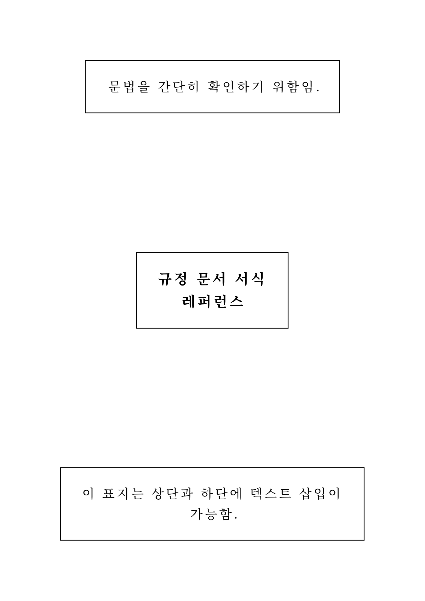
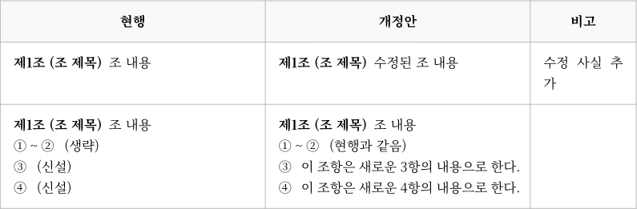
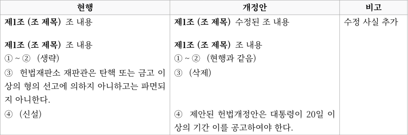
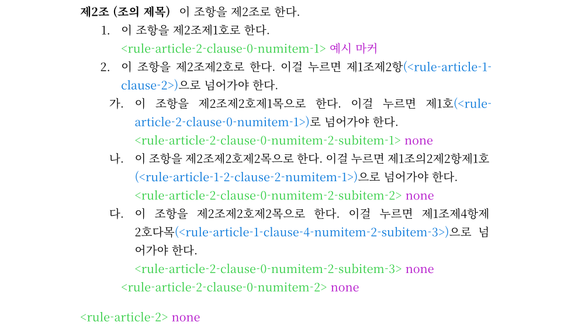
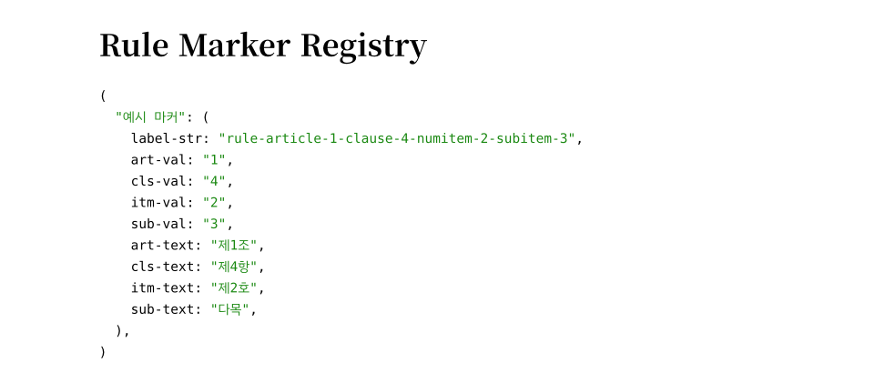

# Typst 규정 문서 양식

이 양식은 여러 종류의 규정 문서를 Typst로 제작할 수 있도록 하기 위해 만들어졌습니다.

## 용도 예시

- **거의 모든 종류의 규정 문서**: 아래와 같이 법령과 같은 체계 혹은 법령 체계의 일부분으로 구성된 규정 문서라면 이 양식을 이용해 작성할 수 있습니다.
  - 본칙과 부칙이 있음
  - 장·절로 구분됨
  - 조·항·호·목 체계를 따름
- **(특히 규정 문서와 관련된) 일반 문서**: Typst의 문법을 이용하여 일반 문서 역시 작성할 수 있습니다.
  - 개정안: 신·구조문대비표를 내장하고 있어 쉽게 작성할 수 있습니다.

## 사용법

[Typst 웹앱](https://typst.app/)에서의 사용을 기준으로 합니다.

Typst 웹앱은 프로젝트 zip 파일 등을 업로드하거나 (Typst Pro로 업그레이드하지 않는 이상) GitHub에서 프로젝트를 가져올 수 없으므로 수동으로 업로드해야 합니다.

1. Typst 웹앱에 로그인한 다음 상단 + Empty document 버튼을 눌러주세요.
2. Project name을 입력해주세요.
3. 파일 목록이 보이지 않는 경우, 왼쪽 맨 위 아이콘(Explore files)을 눌러주세요.
4. Files 메뉴의 New file 혹은 Files 글씨 오른쪽 문서 아이콘(Add a new file)을 통해 새 파일을 하나 만들어주세요. 이름은 `template.typ`로 합니다.
5. `template.typ` 파일을 열어 이 저장소 template.typ 파일의 전체 내용을 복사 후 붙여넣기 해주세요.
6. 준비가 모두 끝났습니다. 문서는 기본적으로 생성된 `main.typ` 파일에서 편집하면 됩니다.

## 작성법

먼저, 문서의 시작 부분에서 `rule-document`를 호출해야 합니다.

```typst
#import "template.typ": *
#show: rule-document.with(document-title: "규정 명칭")
```

### 페이지 구성하기

#### 표지와 목차 페이지

표지와 목차 페이지를 배치하기 전, 아래 코드를 통해 페이지 레이아웃을 설정해야 합니다.

```typst
#show: cover-page
```

표지는 아래 2개 중 하나를 선택하여 사용할 수 있습니다.

```typst
#cover(
  [규정 문서 양식 \ 레퍼런스],
  "1970. 01. 01",
  rgb("#239dad"),
  image("sub_logo.png", height: 10mm),
  image("main_logo.png", height: 15mm),
)
```

위 코드는 로고와 제목, 개정 일자와 간단한 장식이 포함된 표지 페이지를 만듭니다. 함수의 4번째 인수로 오는 이미지는 표지 페이지의 왼쪽 위에 배치되고, 5번째 인수로 오는 이미지는 가운데 하단에 배치됩니다. 왼쪽 위에 넣는 이미지로는 슬로건 등이 있을 수 있고, 가운데 하단에 넣는 이미지로는 공식 로고 등이 적절합니다.

```typst
#simple-cover(
  [규정 문서 양식 \ 레퍼런스],
  top-text: [문법을 간단히 확인하기 위함임.],
  bottom-text: [이 표지는 상단과 하단에 텍스트 삽입이 가능함.]
)
```

반면, 위 코드는 장식이 거의 없고 제목과 상·하단 텍스트가 직사각형 박스로 둘러싸여 있는 형태의 표지 페이지를 만듭니다.

|  |  |
| :-----------------------------------------------------: | :----------------------------------------------------------: |
|                        일반 표지                        |                         간단한 표지                          |

목차 페이지를 만들고 싶다면 표지 페이지 바로 아래에 아래 코드를 삽입하면 됩니다.

```typst
#toc-page()
```

#### 본문 페이지

문서의 본문을 작성하기 전, 아래 코드를 통해 페이지의 레이아웃을 설정해야 합니다.

```typst
#show: body-page
```

### 개정 이력

`#revision-history((...))` 형식으로 작성하는데, `...` 부분에는 `("날짜", "내용")` 형식이 옵니다. 구체적으로, 아래와 같이 작성합니다.

```typst
#revision-history((
  ("2020. 01. 01.", "제정"),
  ("2021. 01. 01.", "1차 개정"),
  ("2022. 01. 01.", "2차 개정"),
  ("2023. 01. 01.", "3차 개정"),
  ("2024. 01. 01.", "4차 개정"),
  ("2025. 01. 01.", "5차 개정"),
  ("2026. 01. 01.", "6차 개정"),
))
```


기본적으로 개정 이력은 위 사진과 같이 오른쪽 정렬됩니다. 다른 방향으로 정렬하고 싶다면 아래 코드처럼 정렬 방향을 따로 명시해줄 수 있습니다.

```typst
#revision-history((
  ...
), alignment: left)
```

`alignment`에는 `left`(왼쪽 정렬), `center`(가운데 정렬), `right`(오른쪽 정렬) 등의 값을 넣어줄 수 있습니다.

### 규정 작성하기

규정의 계층은 아래 함수들을 사용하여 작성합니다.

| 계층 | 함수                                                         | 결과                                                         |
| :--- | ------------------------------------------------------------ | :----------------------------------------------------------- |
| 장   | `#chapter[제목]`                                             | **제1장 총칙**                                               |
| 부칙 | `#addendum[부칙]`                                            | **부칙**                                                     |
| 절   | `#section-title[제목]`                                       | **제1절 제목**                                               |
| 조   | `#article[제목][내용]`<br />`#b-article[제목][내용]`<br />`#manual-article(7)[제목][내용]`<br />`#manual-article("8-9")[제목][내용]` | **제1조 (제목)** 내용<br />**제1조의2 (제목)** 내용<br />**제7조 (제목)** 내용<br />**제8조의9 (제목)** 내용 |
| 항   | `#clause[내용]`<br />`#manual-clause(7)[내용]`<br />`#manual-clause("8~9")[내용]` | ① 내용<br />⑦ 내용<br />⑧ \~ ⑨ 내용                          |
| 호   | `#numitem[내용]`<br />`#manual-numitem(7)[내용]`<br />`#manual-numitem("8~9")[내용]` | 1. 내용<br />7. 내용<br />8 ~ 9. 내용                        |
| 목   | `#subitem[내용]`<br />`#manual-subitem(7)[내용]`<br />`#manual-subitem("8~9")[내용]` | 가. 내용<br />사. 내용<br />아 ~ 자. 내용                    |


조, 항, 호, 목의 경우 앞에 `manual-`을 붙인 함수 `manual-article`, `manual-clause`, `manual-numitem`, `manual-subitem`을 통해 번호를 직접 지정할 수 있습니다. 규정문에서는 불필요한 기능이지만 일반 문서, 특히 신·구조문대비표에서 유용합니다. `#manual-clause(번호)[내용]`과 같이 사용하며, `번호` 부분에는 일반 숫자가 올 수도 있지만 항, 호, 목의 경우 `"1 ~ 3"` 형태의 범위가 올 수도 있습니다.

조는 가지번호를 사용할 수 있으며, `branch-article` 또는 `b-article` 함수를 사용합니다. 번호를 직접 지정할 때에는 `manual-article`에서 번호 부분에 `"1 - 3"`처럼 작성하면 제1조의3이 됩니다.

부칙은 장과 비슷하지만 번호를 붙이지 않습니다.

조에 속하는 항과 호, 항에 속하는 호, 호에 속하는 목은 중첩하여 작성하는 것이 좋습니다. 즉,

```typst
#article[조의 제목][이 조항을 제1조로 한다.]
#clause[이 조항을 제1조제1항으로 한다.]
#clause[이 조항을 제1조제2항으로 한다.]
#clause[이 조항을 제1조제3항으로 한다.]
```

이러한 코드보다는

```typst
#article[조의 제목][
  이 조항을 제1조로 한다.
  #clause[이 조항을 제1조제1항으로 한다.]
  #clause[이 조항을 제1조제2항으로 한다.]
  #clause[이 조항을 제1조제3항으로 한다.]
]
```

이러한 코드가 더 안정적으로 동작합니다. 단, 조의 가지번호는 별개의 조항으로, 중첩하여 작성하지 않습니다.

### 규정 인용하기

> 경고⚠️: 이 부분은 충분히 테스트되지 않았으니 사용 시 링크가 잘 작동하는지, 내용이 잘 표시되는지 꼭 확인해주시기 바랍니다.

#### 직접 인용하기

'○○에 관하여는 제○조를 준용한다.'와 같은 준용문이나 '제○조에도 불구하고'와 같은 인용문같이, 같은 규정 내의 다른 조항을 인용해야 할 때가 있습니다. 이 경우 `at` 함수를 사용할 수 있습니다. 인용문을 글자로만 작성하는 것과 달리, `at` 함수를 사용하게 되면 해당 인용문을 클릭했을 때 인용된 조항으로 이동하는 링크가 추가됩니다. 

`at` 함수는 조문 내부에서 `#at[인용 조항]`과 같이 사용하는데, `인용 조항` 부분에는 일반적으로 인용문을 작성하는 것처럼, `제○조제○항`, `제○조제○호`, `제○조제○항부터 제○항까지` 등의 형식으로 작성하면 됩니다. `인용 조항`에 작성한 내용 그대로 문서에 표시되며, `인용 조항`이 가리키는 조항을 향하는 링크가 삽입됩니다. 조/항/호/목 체계 내의 어느 조항이든 인용할 수 있으며, 조, 항, 호를 생략할 때 인용된 부분에 해당하는 조, 항, 호를 자동으로 찾습니다. 만약 찾지 못하면 오류가 발생합니다.

예를 들어, 현재 제3조 제4항 제5호 바목을 작성하고 있다고 가정합니다.

| `at` 함수의 쓰임                                         | 링크 위치              | 표시되는 내용                                       |
| -------------------------------------------------------- | ---------------------- | --------------------------------------------------- |
| `... #at[다목] ...`                                      | 제3조 제4항 제5호 다목 | `... 다목 ...`                                      |
| `... #at[제3호] ...`                                     | 제3조 제4항 제3호      | `... 제3호 ...`                                     |
| `... #at[제2항] ...`                                     | 제3조 제2항            | `... 제2항 ...`                                     |
| `... #at[제1조] ...`                                     | 제1조                  | `... 제1조 ...`                                     |
| `... #at[제3항제4호] ...`                                | 제3조 제3항 제4호      | `... 제3항제4호 ...`                                |
| `... #at[제2조제3항부터 제6항까지] ...`                  | 제2조 제3항            | `... 제2조제3항부터 제6항까지 ...`                  |
| `#at[제2호, 제3호 및 제4호]의 어느 하나에 해당하는 경우` | 제3조 제2호            | `제2호, 제3호 및 제4호의 어느 하나에 해당하는 경우` |

마지막 예시의 경우, `#at[제2호], #at[제3호] 및 #at[제4호]의 어느 하나에 해당하는 경우`과 같이 작성하여 각각의 호를 가리키는 링크를 삽입할 수도 있습니다. 이러한 예시와 같이 하나의 `at` 함수에 같은 단계의 조항이 여러 개가 오는 경우, 그 중 첫 번째 조항을 가리키는 링크가 삽입되기 때문에 나머지 조항에 대해서는 존재 여부를 검증하지 않습니다. 단, 다른 단계의 조항이 여러 개가 오는 경우나 연속하지 않은 같은 단계의 조항이 오는 경우에도 첫 번째 조항의 링크만 삽입되기 때문에 이 경우 각각의 조항에 대해 `at` 함수를 사용해야 합니다.

#### 별명으로 인용하기

조항에 일종의 별명을 짓고, 해당 별명으로 조항을 인용할 수 있습니다. 이 방법은 기존의 조⋅항⋅호⋅목 사이에 조⋅항⋅호⋅목을 신설하는 경우 위치가 변경된 현행 조항을 인용하는 조문이 있을 경우 해당 조문의 인용문과 링크가 자동으로 바뀐다는 장점이 있습니다.

조항에 별명을 지으려면, `article`, `clause`, `numitem`, `subitem` 함수들에 대해 `[제목][내용]` 혹은 `[내용]` 부분이 오기 전 `(m: "원하는 별명 이름")`을 붙여주면 됩니다. `원하는 별명 이름`은 형식을 제한하고 있지 않지만, 작성의 편의를 위해 한글 혹은 영어로 작성된 해당 조항을 요약하는 짧은 한두 단어 정도를 추천합니다. 만약, 앞에 `manual-`이 붙은 함수에 별명을 지으려면 `(숫자 혹은 가지번호나 범위)` 부분을 `(숫자 혹은 가지번호나 범위, m: "원하는 별명 이름")`으로 바꿔주면 됩니다. 즉, 아래 표와 같이 별명을 지을 수 있습니다.

| 계층 | 별명을 지으려는 함수                                         | 별명을 지은 함수                                             |
| :--- | ------------------------------------------------------------ | :----------------------------------------------------------- |
| 조   | `#article[제목][내용]`<br />`#b-article[제목][내용]`<br />`#manual-article(7)[제목][내용]`<br />`#manual-article("8-9")[제목][내용]` | `#article(m: "원하는 별명 이름")[제목][내용]`<br />`#b-article(m: "원하는 별명 이름")[제목][내용]`<br />`#manual-article(7, m: "원하는 별명 이름")[제목][내용]`<br />`#manual-article("8-9", m: "원하는 별명 이름")[제목][내용]` |
| 항   | `#clause[내용]`<br />`#manual-clause(7)[내용]`<br />`#manual-clause("8~9")[내용]` | `#clause(m: "원하는 별명 이름")[내용]`<br />`#manual-clause(7, m: "원하는 별명 이름")[내용]`<br />`#manual-clause("8~9", m: "원하는 별명 이름")[내용]` |
| 호   | `#numitem[내용]`<br />`#manual-numitem(7)[내용]`<br />`#manual-numitem("8~9")[내용]` | `#numitem(m: "원하는 별명 이름")[내용]`<br />`#manual-numitem(7, m: "원하는 별명 이름")[내용]`<br />`#manual-numitem("8~9", m: "원하는 별명 이름")[내용]` |
| 목   | `#subitem[내용]`<br />`#manual-subitem(7)[내용]`<br />`#manual-subitem("8~9")[내용]` | `#subitem(m: "원하는 별명 이름")[내용]`<br />`#manual-subitem(7, m: "원하는 별명 이름")[내용]`<br />`#manual-subitem("8~9", m: "원하는 별명 이름")[내용]` |

별명으로 조항을 인용하기 위해서는 조문 내부에서 `at`을 사용하는 것과 비슷하게, `at-m`을 사용하면 됩니다. 조문 내부에서 `#at-m("원하는 별명 이름")`과 같이 사용하며, '제0조제0항제0호제0목'의 형식으로 인용문을 작성하지만, 만약 조⋅항⋅호⋅목 중 상위 체계가 겹치는 경우에는 그 부분을 생략하여 가장 짧은 인용문을 만들어냅니다. 예를 들어, 제3조 제4항 제5호에서 제3조 제2항을 별명 `삼이`를 이용해 인용하고자 할 경우, `#at-m("삼이")`와 같이 사용하면 '제2항'이 작성됩니다.

또한, 드문 경우이지만 `#manual-clause("8~9", m: "팔부터구")[내용]`처럼 범위로 지정된 조항을 `#at-m("팔부터구")`로 인용하는 경우, '제8항부터 제9항까지'와 같은 범위가 지정된 인용문이 작성됩니다. 반면, `manual-` 함수로 작성된 수동 범위 조항(예시: `#manual-clause("8~9")[내용]`)을 `#at` 함수에 범위 인용을 넘겨 인용하고자 하는 경우(예시: `#at[제8항부터 제9항까지]`) 동작하지 않으며, 인용 대상을 찾을 수 없다는 오류가 발생합니다. 따라서 `#at-m`을 통한 별명 인용은 `manual-` 함수로 작성된 범위 조항을 인용할 수 있는 유일한 방법입니다.

#### 부칙 인용에 대해

부칙에서 본칙을 인용해야 하거나, 본칙에서 부칙을 인용해야 하는 경우, `at` 함수에 '부칙' 글자를 넣어 인용 대상의 위치가 부칙임을 알릴 수 있습니다. 이 경우 아래와 같이 작동합니다.

| 함수가 사용되는 위치 | 인용 대상 위치          | 인용 대상의 조⋅항⋅호⋅목                  | 인용 대상을 실제로 찾는 곳 |
| -------------------- | ----------------------- | ---------------------------------------- | -------------------------- |
| 본칙                 | 본칙(즉, 명시되지 않음) | 상관 없음                                | 본칙                       |
| 본칙                 | 부칙                    | 상관 없음                                | 부칙                       |
| 부칙                 | 부칙                    | 상관 없음                                | 부칙                       |
| 부칙                 | 본칙(즉, 명시되지 않음) | **조 포함**                              | **본칙**                   |
| 부칙                 | 본칙(즉, 명시되지 않음) | **조 미포함, 항⋅호⋅목 중 1개 이상 포함** | **부칙**                   |

이는 부칙 내에서 조를 인용하는 경우 대부분 본칙이고, 항⋅호⋅목에서만 인용하는 경우 대부분 부칙이라는 경험 법칙에 의거합니다. 그러나 법령 입안 심사 기준에는 부칙에서 부칙 내 다른 조항을 인용할 때에는 '부칙 제○조' 등과 같이 부칙임을 표시하여 본칙 규정을 인용할 때와 구별하라고 적혀 있으므로 이 원칙을 따를 것을 권장합니다.

### 신·구조문대비표

`side-by-side-table((...))`함수에 `compare-row([...], [...], remark: [...])`함수를 쌓아 만들 수 있습니다. 대략 아래와 같은 형식입니다.

```typst
#side-by-side-table((
	compare-row([...], [...], remark: [...]),
	compare-row([...], [...], remark: [...]),
	compare-row([...], [...], remark: [...]),
	...
))
```



구체적으로, `side-by-side-table` 함수는 인자로 배열(리스트)을 받습니다. 그 배열에는 `compare-row([...], [...], remark: [...])`이 들어가야 합니다.

`compare-row` 함수는 첫 번째 인수에 현행 내용, 두 번째 인수에 개정 내용, `remark: `와 함께 오는 인수에 비고란에 오는 내용을 넣어 사용합니다. 첫 번째와 두 번째 인수에는 규정 문서를 작성할 때와 똑같이, `manual-article`, `manual-clause`, `manual-numitem`, `manual-subitem`을 사용하여 작성할 수 있으며, 필요한 경우 항, 호, 목에 범위 표현을 사용할 수 있습니다.

또한, `side-by-side-table` 함수의 인수로 `hide-inner-stroke`, `no-inset`, `hide-remark`를 같이 넘길 수 있습니다.

- `hide-inner-stroke`: `true`면 표 내부의 가로선을 그리지 않습니다. (기본값: `false`)
- `no-inset`: `true`면 표의 각 셀 안쪽 내용을 둘러싸는 여백을 두지 않습니다. (기본값: `false`)
- `hide-remark`: `true`면 비고 열이 안 보입니다. (기본값: `false`)

만약 조항 단위로 세로 위치를 맞추고 싶은 경우, 조⋅항⋅호⋅목 단계와 상관없이, 조항 당 하나의 `compare-row`를 사용할 수 있습니다. 이 경우, `hide-inner-stroke: true`, `no-inset: true`를 추천합니다(`#side-by-side-table(hide-inner-stroke: true, no-inset: true, (...))`).



### 일반 문서

Typst의 문법을 그대로 사용할 수 있습니다. Typst로 문서를 작성하는 방법에 대해서는 [공식 문서의 튜토리얼](https://typst.app/docs/tutorial/writing-in-typst/)을 참고하십시오.

제목은 2단계부터 6단계까지 1., 가., 1), 가), (1) 형식으로 번호를 매깁니다. 1단계 제목은 번호 매김 없이 왼쪽 정렬된, 굵고 큰 텍스트를 만듭니다.

### 문장 부호

자주 사용하지만, 키보드로 입력하기 힘든 몇 가지 문장 부호를 함수로 사용할 수 있습니다.

| 문장부호 함수                           | 결과                       |
| --------------------------------------- | -------------------------- |
| `#d-bracket[겹낫표]`                    | 『겹낫표』                 |
| `#d-arrow[겹화살괄호]`                  | 《겹화살괄호》             |
| `#s-bracket[홑낫표]`                    | ｢홑낫표｣                   |
| `#s-arrow[홑화살괄호]`                  | 〈홑화살괄호〉             |
| `이것 #cdot 저것`<br />`이것#cdot\저것` | 이것 · 저것<br />이것·저것 |

홑화살괄호의 경우, 키보드에서 입력할 수 있는 `<`, `>`와는 다른 기호를 사용합니다.

## 고급 사용법

### 문서 여백 변경하기

`rule-document` 함수는 3개의 여백 관련 인자를 받습니다.

```typst
#show: rule-document.with(
  ...,
  margin: (top: 30mm, bottom: 30mm, left: 30mm, right: 30mm, footer: 15mm),
  compact-margin: (top: 15mm, bottom: 15mm, left: 20mm, right: 20mm, footer: 3mm),
  cover-margin: (top: 30mm, bottom: 30mm, left: 30mm, right: 30mm, footer: 15mm),
)
```

`margin`과 `compact-margin`는 본문에서, `cover-margin`는 표지 페이지에서 사용되는 여백입니다. 각 여백 인자는 위의 코드처럼, `(top: ..., bottom: ..., left: ..., right: ..., footer: ...)` 형식의 값을 받으며, 각각 위쪽 여백, 아래쪽 여백, 왼쪽 여백, 오른쪽 여백, 꼬리말(페이지 번호) 위치입니다. 단, 일반적인 문서 편집 프로그램과 다르게, 꼬리말 위치는 문서의 가장 아래(즉, 종이 아래쪽 모서리에서 `bottom`만큼 위)에서 내려갈 길이가 됩니다. 예를 들어, `bottom`이 15mm이고, `footer`가 3mm라면 하단 여백은 15mm가 되고, 꼬리말은 15mm에서 3mm만큼 더 내려간, 종이 아래쪽 모서리에서 12mm에 놓이게 됩니다.

본문 페이지에서 여백을 넓게 할 것인지, 좁게 할 것인지 여부는 `body-page` 함수가 결정합니다. 아래 코드처럼 작성하면 `margin`에 지정된 넓은 여백을 사용합니다.

```typst
#show: body-page
```

`compact-margin`에 지정된 좁은 여백을 사용하려면 아래와 같이 작성합니다.

```typst
#show: body-page.with(compact-margin: true)
```

넓은 여백은 규정 문서를 작성할 때, 좁은 여백은 개정안과 같은 일반 문서를 작성할 때 처럼 용도를 정해 사용할 수 있습니다.

### 글꼴 변경하기

`rule-document` 함수는 3개의 글꼴 관련 인자를 받습니다.

```typst
#show: rule-document.with(
  ...,
  serif: "Noto Serif CJK KR",
  san-serif: "Noto Sans CJK KR",
  default-font-type: "serif",
)
```

`serif`에는 바탕 글꼴을, `san-serif`에는 고딕 글꼴을 지정할 수 있으며, `default-font-type`에 `"san-serif"` 혹은 `"고딕"`을 넣는다면 문서 전체에 사용할 글꼴을 지정할 수 있습니다.

기본적으로 위의 예시 코드에도 적혀있는 본명조와 본고딕이 사용됩니다. 만약 웹(`typst.app`)에서 문서를 편집하고 있고, 다른 글꼴을 사용하고 싶다면 해당 글꼴 파일을 프로젝트에 업로드한 다음 글꼴의 영어 이름을 작성하면 됩니다. 예를 들어, 마루 부리를 사용하고 싶은 경우 `san-serif: "MaruBuri"`를 넘겨주면 됩니다. 아래는 몇 가지 자주 사용되는 글꼴(바탕)에 대한 영어 이름입니다.

- 본명조: `Noto Sans CJK KR`
- 나눔명조: `NanumMyeongjo`
- 마루부리: `MaruBuri`
- KoPub World/KoPub 2.0: `KoPubWorldBatang`/`KoPubBatang`
- 고운바탕: `Gowun Batang`
- 함초롱바탕: 용량이 너무 커 사용 불가

### 페이지 번호 형식 변경하기

`rule-document` 에 아래와 같이 작성하면 페이지 번호 형식을 변경할 수 있습니다.

```typst
#show: rule-document.with(
  ...,
  page-numbering: (content: [-- 1 --], alignment: center),
)
```

`page-numbering`를 통해 페이지 번호 형식을 지정해줄 수 있는데, 위의 예시 코드처럼 `(content: ..., alignment: ...)`형식 혹은 `[...]`나 `"..."`와 같은 값을 넘겨도 됩니다. 이때, `[...]`, `"..."`에는 숫자가 포함되어 있어야 합니다. 예를 들어, `"1 페이지"`처럼 작성하면 꼬리말에 '3 페이지', '4 페이지', ...처럼 작성됩니다. 만약 `[*1* 페이지]`와 같이 서식을 넣는다면 해당 서식이 그대로 반영됩니다. 예시의 경우, '**1** 페이지'처럼 숫자가 굵게 작성됩니다. `content: ...`의 `...`  부분에도 앞선 설명과 똑같은 `[...]`나 `"..."` 형식을 넣을 수 있습니다. 추가로, `alignment`에는 페이지 번호를 어디에 정렬할지 선택할 수 있으며, `left`(왼쪽 정렬), `center`(가운데 정렬), `right`(오른쪽 정렬) 등의 값을 넣어줄 수 있습니다.

### 링크 색 바꾸기

기본적으로 특정 조항을 인용하여 링크를 삽입해도 해당 인용문의 글자 색은 변하지 않습니다. 인용문을 포함하여 모든 링크의 글자 색을 바꾸고 싶다면 아래와 같이 작성하면 됩니다.

```typst
#show: rule-document.with(
  ...,
  link-color: blue,
)
```

사용할 수 있는 색에 대해서는 [Typst 문서](https://typst.app/docs/reference/visualize/color/)를 참고하십시오. 위 예시에서 `blue`는 `rgb("#0074d9")`와 같으며, 링크 글자 색을 `#0074d9` 색으로 바꿉니다.

### 디버그 모드

`rule-document` 함수는 문서 전체에 걸쳐 디버그 모드를 켜거나 끌 수 있습니다. 이는 인용과 관련하여 링크가 잘못 연결되거나 인용 관련 오류가 발생하는 경우 그 원인을 찾는데 유용합니다. `rule-document` 호출을 아래처럼 수정하여 디버그 모드를 사용할 수 있습니다.

```typst
#show: rule-document.with(
  ...,
  debug: true,
)
```

디버그 모드가 켜지면 인용 관련 오류가 사라짐과 동시에, 각 조항이 끝나는 부분 아래에 초록색 글씨와 보라색 글씨가 나타나고, `at`과 `at-m`이 사용된 부분에 파란색 글씨가 나타납니다. `at`이 사용된 경우 초록색 글씨의 내용이 인용된 부분의 파란색 글씨의 내용과 일치해야 합니다. `at-m`이 사용된 경우 `at-m`에 사용한 별명과 보라색 글씨가 일치한 곳을 찾은 다음 그쪽에 표시된 초록색 글씨의 내용과 `at-m`에 표시된 파란색 글씨의 내용이 일치해야 합니다. 만약 일치하지 않다면 이는 양식의 버그로, 이슈를 남겨주시기 바랍니다.



또한, 맨 마지막 장에 제목이 `Rule Marker Registry`인 새로운 페이지가 만들어집니다. 여기서는 조항에 붙은 별명과 각 조항 간 연결을 확인해볼 수 있습니다. 해당 페이지에서 확인하고 싶은 조항의 별명을 찾은 다음, 해당 별명의 소괄호 안 `art-text`, `cls-text`, `itm-text`, `sub-text`를 확인해보시기 바랍니다. 각각 조, 항, 호, 목의 인용문 부분으로, 순서대로 읽는다면 작성한 규정 내부의 해당 별명을 가지고 있는 어느 한 조항을 가리키고 있어야 합니다. 만약 해당 별명을 가지고 있는 조항과 다른 조항을 가리키고 있다면 이 역시 양식의 버그로, 이슈를 남겨주시기 바랍니다.



### 문서 설정 기본값

아래 코드는 `#show: rule-document`를 했을 때 기본으로 설정되는 값들을 모아 `#show: rule-document(...)` 형식으로 만든 것입니다.

```typst
#show: rule-document.with(
  document-title: none,
  serif: "Noto Serif CJK KR",
  san-serif: "Noto Sans CJK KR",
  default-font-type: "serif",
  margin: (top: 30mm, bottom: 30mm, left: 30mm, right: 30mm, footer: 15mm),
  compact-margin: (top: 15mm, bottom: 15mm, left: 20mm, right: 20mm, footer: 3mm),
  cover-margin: (top: 30mm, bottom: 30mm, left: 30mm, right: 30mm, footer: 15mm),
  page-numbering: (content: [-- 1 --], alignment: center),
  link-color: none,
  debug: false,
)
```

여기서 상당 부분을 수정하고 싶은 경우, 위 코드를 복사한 다음 수정하는 것을 추천합니다.

## 예시 문서

`example` 디렉토리 안에 2개의 예시 문서가 있습니다.

- `example/charter/main.typ`: 단체의 정관
- `example/amendment.typ`: 정관의 일부개정안